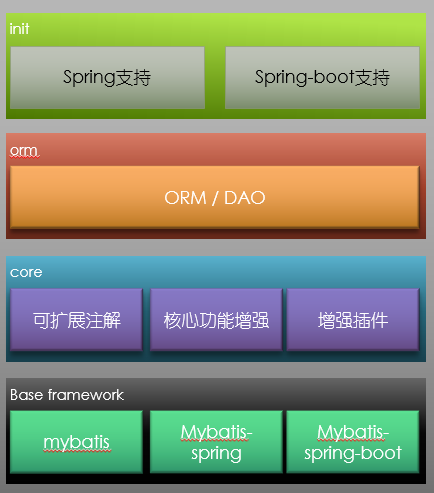

# StupidMybatis
StupidMybatis是一个mybatis扩展框架，提供了可扩展的mybatis注解增强以及通过注解实现的核心能力的增强，用于简化mybatis映射接口的使用以及基于mybatis的DAO开发。

## 基础架构 


StupidMybatis为增强mybatis映射接口，并使得映射接口的注解具备较强的扩展性开发，从下到上分为三层
* 基础框架层：StupidMybatis基于mybatis, spring-mybatis以及mybatis-spring-boot开发
* 核心层：StupidMybatis的核心能力
    * 提供可扩展的注解机制，分为配置处理注解与运行处理注解两部分，分别用于增强mybatis的配置和增强mybatis的数据访问的执行能力
    * 基于可扩展的注解机制提供一定的核心功能增强
    * 增强插件：用于增强mybatis核心能力的mybatis插件(这部分后面可提升到上一层)
* 支持层，包含三个部分：
    * 对spring的支持：用于支持传统的spring-mybatis的整合开发
    * 对spring-boot的支持：提供快速自动配置能力
    * ORM / DAO：封装基于StupidMybatis核心层的基础DAO操作，减少DAO层的开发成本，提高DAO层的开发速度
    
## 框架特性
* 可重用的@Results
* 使用default method作为ResultMap
* 支持映射接口中默认方法的调用
* 排序分页查询的增强(select * from table_name where id > #{lastPageMaxId} order by id limit #{pageSize})
* 注解可扩展，可通过注解的扩展定制MappedStatement，给框架新增特性
* 可通过注解扩展，对查询结果做后置处理
* 默认ResultMap
* 常用DAO方法（CURD）的封装，不需要重新开发
* 批量更新插件
* in查询插件
* 自动分页查询所有数据
* 完全兼容原生mybatis
* 支持mybatis-spring和mybatis-spring-boot

## 使用配置
### 使用spring
使用StupidMybatis，先将spring中的SqlSessionFactoryBean替换成StupidSqlSessionFactoryBean,使用方式与SqlSessionFactory相同，例如：
```xml
  <bean id = "sqlSession" class="cn.yxffcode.stupidmybatis.spring.StupidSqlSessionFactoryBean">
    <property name="dataSource" ref="dataSource"/>
    <property name="configLocation" value="classpath:mybatis-config.xml"/>
  </bean>
```

### 使用spring-boot
如果使用spring-boot，需要额外添加一个注解@EnableStupidMybatis，例如：
```java
@SpringBootApplication
@EnableStupidMybatis
@MapperScan(basePackages = "xxx")//扫描标记了@Mapper的接口
public class MyApplication{
  public static void main(String[] args){
    SpringApplcation.run(MyApplication.class);
  }
}
```
### 不使用Spring
如果不使用spring，则需要将SqlSessionFactoryBuilder替换成StupidSqlSessionFactoryBuilder,例如：
```java
String resource = "mybatis-config.xml";
InputStream inputStream = Resources.getResourceAsStream(resource);
SqlSessionFactory sqlSessionFactory = new StupidSqlSessionFactoryBuilder().build(inputStream);
```

## 可复用的Result注解
mybatis提供的@esults注解只能标记在声明注解的方法上，如果有多个查询方法需要使用到相同的@Results注解，
只能再次配置一遍@Result或者使用xml，stupidmybatis提供了@TypeResultMap，可使得通过注解配置的Result
可复用

### 使用方式

原始的通过@Result配置的代码如下：
```java
public interface UserDao {

  @Select({
      "select id, name from user"
  })
  //p定义resultmap
  @Results({
      @Result(property = "id", column = "id"),
      @Result(property = "name", column = "name")
  })
  List<User> selectAll();

  @Select("select id, name from user where id = #{id}")
  //再次定义相同的resultmap
  @Results({
        @Result(property = "id", column = "id"),
        @Result(property = "name", column = "name")
    })
  User selectById(@Param("id") int id);
}

```

可以看到需要重复定义@Results，当使用@TypeResultMap后的代码：
```java
public interface UserDao {

  @Select({
      "select id, name from user"
  })
  @ResultMap("userMapper")
  List<User> selectAll();

  @Select("select id, name from user where id = #{id}")
  @ResultMap("userMapper")
  User selectById(@Param("id") int id);

  /**
   * 定义ResultMap， 可指定id和resultType作为resultMapId和resultMap的返回类型, 
   * 默认的resultMapId为方法名，默认的返回类型是方法的返回类型或者方法的返回类型中的元素
   */
  @TypeResultMap({
      @Result(property = "id", column = "idFactory"),
      @Result(property = "name", column = "name")
  })
  User userMapper();
}
```
TypeResultMap还可声明在Mapper接口的类型上，但必须要指定id和resultType，无法使用这两个属性的默认值：
```java
/**
 * 定义ResultMap， 必须指定id和resultType作为resultMapId和resultMap的返回类型
 */
@TypeResultMap(id = "userMapper", resultType = User.class, value = {
  @Result(property = "id", column = "idFactory"),
  @Result(property = "name", column = "name")
})
public interface UserDao {

  @Select({
      "select id, name from user"
  })
  @ResultMap("userMapper")
  List<User> selectAll();

  @Select("select id, name from user where id = #{id}")
  @ResultMap("userMapper")
  User selectById(@Param("id") int id);
}
```

## 指定默认方法作为ResultMap
@Results/@TypeResultMap只是简单的映射，没有任务的转换逻辑，假如转换成POJO的时候，需要有转换逻辑（例如多个字段拼接）
可以指定一个默认方法作为ResultMap，使用方式如下：

```java
public interface UserDao {

  @Select("select id, name from user where id = #{id}")
  @MapperMethod("mapToUser")//指定mapToUser方法作为ResultMap
  User selectById(@Param("id") int id);

  /**
   * 此方法作为ResultMap，这种用法需要Java8以上
   */
  default User mapToUser(Map<String, ?> result) {
    if (result == null) {
      return null;
    }
    User user = new User();
    //mybatis返回的map中，字段都是大写
    user.setId((Integer) result.get("ID"));
    user.setName((String) result.get("NAME"));
    return user;
  }
}
```
映射方法的参数需要是Map

指定默认方法作为ResultMap这种使用方式，还可以结合其它ResultMap，例如：
```java
public interface UserDao {

  @Select("select id, name from user where id = #{id}")
  @ResultMap("mapMapper")//指定一个名为mapMapper的返回Map的ResultMap
  @MapperMethod("mapToUser")//转换mapMapper返回的Map
  User selectById(@Param("id") int id);
  
  /**
   *  mapMapper is a result map
   */
  @TypeResultMap({
      @Result(property = "id", column = "id"),
      @Result(property = "name", column = "name")
  })
  Map mapMapper();

  /**
   * @param result
   * @return
   */
  default User mapToUser(Map<String, ?> result) {
    if (result == null) {
      return null;
    }
    User user = new User();
    user.setId((Integer) result.get("id"));
    user.setName((String) result.get("name"));
    return user;
  }

}

```

上面的例子中，先使用mapMapper将结果转换成Map，再通过mapToUser方法将Map转换成User。

同时使用ResultMap和映射方法的时候，映射方法的参数需要和ResultMap的返回类型相同，
假如指定的ResultMap返回的是一个POJO对象，比如User，则映射方法的参数需要是User，例如：
```java
public interface UserDao {

  @Select("select id, name from user where id = #{id}")
  @ResultMap("userMapper")
  @MapperMethod("userTransform")
  User selectById(@Param("id") int id);

  @TypeResultMap({
      @Result(property = "id", column = "id"),
      @Result(property = "name", column = "name")
  })
  User userMapper();

  default User userTransform(User user) {
    if (user == null) {
      return null;
    }
    user.setName("hello " + user.getName());//修改name的值
    return user;
  }

}

```

## 调用映射接口的默认方法
原生mybatis不支持java8的默认方法调用，会有找不到statement的异常，stupidmybatis支持默认方法的调用，例如如下DAO中，mapToUser方法可单独调用

```java
public interface UserDao {

  @Select("select id, name from user where id = #{id}")
  @MapperMethod("mapToUser")
  User selectById(@Param("id") int id);

  default User mapToUser(Map<String, ?> result) {
    if (result == null) {
      return null;
    }
    User user = new User();
    user.setId((Integer) result.get("id"));
    user.setName((String) result.get("name"));
    return user;
  }

}

```
调用默认方法：
```java
Map<String, Object> map = Maps.newHashMap();
map.put("id", 0);
map.put("name", "hello");
User user = userDao.mapToUser(map);
```

## 通过主键分页
分页查询通常需要使用offset和limit两个参数，当表中的数据量非常大时，offset会有比较差的性能，
一种优化的分页方式是维护一个id，每次查询时作为参数传入，例如：
```java
@TypeResultMap(id = "userResultMap", resultType = User.class, value = {
    @Result(property = "id", column = "id"),
    @Result(property = "name", column = "name")
})
@Mapper
public interface UserDao {

  @Select("select id, name from user where id > #{lastMaxId} order by id asc limit #{pageSize}")
  @ResultMap("userResultMap")
  List<User> select(@Param("lastMaxId") int lastMaxId, @Param("pageSize") int pageSize);
}
```
在select方法查询到结果后，需要在service中取出最大的id，作为查询下一页时的入参，例如：
```java
public ServiceResult doService(int lastMaxId, int pageSize) {
  List<User> users = userDao.select(lastMaxId, pageSize);
  
  if (CollectionUtils.isEmpty(users)) {
    return emptyResult();//表示空结果 
  }
  User user = users.get(users.size() - 1);//获取最后一个id
  int maxId = user.getId();
  return new ServiceResult(maxId, users);
}
```

整个过程比较繁琐，有不少用于处理非业务相关的代码，StupidMybatis提供了OrderPageList和OrderPagination来解决这种分页查询，例如：
```java
@Mapper
public interface UserDao {

  @Select("select id, name from user where id > #{lastMaxId} order by id asc limit #{pageSize}")
  @Results({
      @Result(property = "id", column = "id"),
      @Result(property = "name", column = "name")
  })//这里也可以使用@ResultMap
  @OrderPagination("id")//指定哪个属性表示的是主键的值，如果主键有多个字段，暂时只支持多个字段通过一个类组合成属性的情况
  OrderPageList<User, Integer> select(@Param("lastMaxId") int lastMaxId, @Param("pageSize") int pageSize);
}
```
OrderPageList中会包含查询结果，通过OrderPageList.getLastId()可获取最后一个元素的id

## 注解扩展
### 对返回结果进行特定的加工
除了上面@MapperMethod能调用默认方法处理返回结果外，还可通过自定义注解的方式处理返回结果，
自定义注解需要通过@MapperResultHandler元注解提供MapperResultPostHandler的实现类，
例如实现一个@PostProcessResult用于打印日志：
```java
@Target(ElementType.METHOD)
@Retention(RetentionPolicy.RUNTIME)
@Inherited
@MapperResultHandler(PostProcessResult.PostProcesser.class)//这里指定MapperResultPostHandler
public @interface PostProcessResult {

  /**
   * 处理返回结果的类
   */
  final class PostProcesser implements MapperResultPostHandler {

    private static final Logger LOGGER = LoggerFactory.getLogger(PostProcessResult.class);

    @Override
    public Object handle(Class<?> type, Method method, Object proxy, Object result) throws Throwable {
      LOGGER.info("{}.{} result is {}", type.getName(), method.getName(), result);
      return result;
    }
  }
}
```
可在DAO上使用@PostProcessResult
```java
@TypeResultMap(id = "userMapper", resultType = User.class, value = {
    @Result(property = "id", column = "id"),
    @Result(property = "name", column = "name")
})
public interface UserDao {

  @Select("select id, name from user where id = #{id}")
  @ResultMap("userMapper")
  @PostProcessResult//此处可使用自定义的结果处理注解
  User selectById(@Param("id") int id);

}

```
### 通过注解对配置的扩展
可自定义注解用于对mybatis进行配置，注解中需要通过@MapperConfHandler元注解指定
MapperConfigHandler接口的实现，例如实现一个自动在sql后面拼上limit的注解@Limit：

```java
@Target(ElementType.METHOD)
@Retention(RetentionPolicy.RUNTIME)
@Inherited
@MapperConfHandler(value = Limit.Config.class, order = MapperConfHandler.Order.AFTER_CONFIG_PARSE)
public @interface Limit {

  /**
   * @return limit 的大小
   */
  int value();

  /**
   * 处理返回结果的类
   */
  final class Config implements MapperConfigHandler<Limit> {
    @Override
    public void handleAnnotation(Limit limit, Class<?> type, Method method, MapperBuilderAssistant assistant) throws Throwable {
      //通过assistant注册配置，不清楚可看看mybatis源码
      String statementId = type.getName() + '.' + method.getName();
      MappedStatement mappedStatement = assistant.getConfiguration().getMappedStatement(statementId);
      
      Reflections.setField(mappedStatement, "sqlSource", new SqlSource() {
        private final SqlSource delegate = mappedStatement.getSqlSource();
        private final Configuration configuration = assistant.getConfiguration();

        @Override
        public BoundSql getBoundSql(Object parameterObject) {
          BoundSql boundSql = delegate.getBoundSql(parameterObject);
          return new BoundSql(configuration, boundSql.getSql() + " limit " + limit.value(), boundSql.getParameterMappings(), boundSql.getParameterObject());
        }
      });
    }

  }
}
```
在DAO上使用@Limit
```java
@TypeResultMap(id = "userMapper", resultType = User.class, value = {
    @Result(property = "id", column = "id"),
    @Result(property = "name", column = "name")
})
public interface UserDao {

  @Select("select id, name from user where id >= #{minId}")
  @ResultMap("userMapper")
  @Limit(100) //limit 100
  List<User> selectUsers(@Param("minId") int id);

}

```

## ORM
StupidMybatis提供了简单的ORM功能，ORM功能提供了默认使用的ResultMap，所有没有标记@Result且没标记@ResultMap
的方法，会使用ORM中提供的ResultMap，使用方式：
```java
@TypeResultMap(id = "userResultMap", resultType = User.class, value = {
    @Result(property = "id", column = "id"),
    @Result(property = "name", column = "name_t")
})
//配置ORM信息
@ORM(tableName = "user", resultMap = "userResultMap", primaryKey = @PrimaryKey(keyColumns = "id", autoGenerate = false))
public interface UserDao {

  @Select("select id, name_t from user")
  List<User> selectAll();//没有指定@Result或者@ResultMap，会使用@ORM中指定的resultMap

}

```

## DAO的通用方法
DAO中会有一些共有的方法（insert, batchInsert, update, batchUpdate，selectById等，详情见BaseDataAccess接口）,
BaseDataAccess接口支持如下方法：
```java
public interface BaseDataAccess<DO, ID> {

  /**
   * 插入数据
   */
  int insert(DO object);

  /**
   * 批量插入
   */
  int batchInsert(List<DO> objects);

  /**
   * 更新数据
   */
  int update(DO object);

  /**
   * 批量更新数据
   */
  int batchUpdate(List<DO> objects);

  /**
   * 通过id查询
   */
  DO selectById(ID id);

  /**
   * 条件查询
   *
   * @param condition 查询条件
   * @return 查询结果
   */
  List<DO> select(DO condition);

  /**
   * 范围查询，带上=参数
   *
   * @param condition 需要相等的条件参数
   * @param range     范围参数
   */
  List<DO> selectFixedRange(DO condition, Range range);

  /**
   * 范围查询
   */
  List<DO> selectRange(Range range);

}

```
这里不提供delete方法，数据一般只逻辑删除。


StupidMybatis通过@ORM的配置，提供了BaseDataAccess作为父接口，使得映射接口中不需要再重复的定义一些基础的方法，使用方式：
```java
@TypeResultMap(id = "userResultMap", resultType = User.class, value = {
    @Result(property = "id", column = "id"),
    @Result(property = "name", column = "name_t")
})
//这里一定要配置@ORM，指定表名，默认的resultMap和主键
@ORM(tableName = "user", resultMap = "userResultMap", primaryKey = @PrimaryKey(keyColumns = "id", autoGenerate = false))
//需要继承BaseDataAccess<DO, ID>接口
public interface UserDao extends BaseDataAccess<User, Integer> {

  @Select("select id, name_t from user")
  List<User> selectAll();

}
```

UserDao中可使用BaseDataAccess中的方法，不需要做其它编码，例如（spring的方式，非spring-boot）：
```java
@RunWith(SpringJUnit4ClassRunner.class)
@ContextConfiguration("classpath:spring.xml")
public class ORMTest {

  @Resource
  private SqlSessionFactory sqlSessionFactory;

  @Test
  public void test() throws IOException {
    SqlSession sqlSession = sqlSessionFactory.openSession();
    UserDao userDao = sqlSession.getMapper(UserDao.class);

    User user = new User();
    user.setId(0);
    user.setName("test");
    userDao.batchInsert(Collections.singletonList(user));
    user.setId(1);
    userDao.insert(user);

    System.out.println("userDao.selectAll() = " + userDao.selectAll());//UserDao中的方法
    System.out.println("userDao.selectById() = " + userDao.selectById(0));//BaseDataAccess中的通用方法

    user.setName("joh");
    System.out.println("userDao.update() = " + userDao.update(user));
    System.out.println("userDao.selectAll() = " + userDao.selectAll());
    user.setName("john");
    System.out.println("userDao.batchUpdate() = " + userDao.batchUpdate(Collections.singletonList(user)));
    System.out.println("userDao.selectAll() = " + userDao.selectAll());

  }
}

```

### 范围查询的使用方式
```java
ConditionRange conditionRange = new ConditionRange("id", 0, 100);
System.out.println("userDao.rangeSelect() = " + userDao.selectRange(conditionRange));
Range range = new LogicRange(conditionRange, LogicRange.Logic.AND, new ConditionRange("name", "a", "z"));
System.out.println("userDao.rangeSelect() = " + userDao.selectRange(range));
```
LogicRange可对任意的Range做AND或者OR的组合

## Mybatis批量插件
mybatis已有的批量更新比较麻烦，要么写动态sql，要么利用BatchExecutor的SqlSession. 
在工程中,更加希望DAO中的方法需要批量的时候用批量,不需要批量的时候不用批量. 有两种方式
实现,一种是实现自定义的Executor,它持有batch与非batch的两个Executor,在执行sql时自
由切换,第二种实现方式则是通过mybatis 插件实现,当需要使用批量时,不使用sqlsession中的
executor,而是使用新的executor. 第一种方式相对稍复杂一点,第二种方式需要将此插件配置
成第一个Executor插件.这里选择使用第二种方式。

此插件用于优化mybatis批量插入/更新/删除的插件. 此插件基于BatchExecutor实现批量更新，
只需要将需要更新的sql id(不包含命名空间)以batch开头，参数需要是Iterable或者数组即可。

### 使用方式
1.配置mybatis插件
```xml
<plugin interceptor="cn.yxffcode.stupidmybatis.core.BatchExecutorInterceptor"></plugin>
```
如果使用了为spring-boot提供的@EnableStupidMybatis注解，则不需要再配置此插件，@EnableStupidMybatis注解会自动配置
2.DAO如果需要使用batch则,参数需要是Iterable或者数组,sql的statement id(不包含命名空间)
要以batch开头,如果是映射接口,则方法名以batch开头:
```java
public interface UserDao {

  @Insert({
          "insert into user (id, name) values (#{id}, #{name})"
  }) 
  int batchInsert(List<User> users);
}
```
### 使用建议
此插件的实现原理是拦截Executor的update方法,然后将目标方法的调用改为创建新的BatchExecutor,
然后执行批量的更新, 但新的BatchExecutor对象没有经过InterceptorChain的包装,所以在此插件之前
的Executor拦截器不会被执行,所以最好是将此插件配置在第一个。

## Mybatis in查询参数插件
在使用mybatis做in查询时，需要写动态sql，如果使用xml则要写forEach标签，如果使用注解，则需要写SqlProvider。
此插件为mysql支持参数为Iterable或者数组的情况，自动将in(#{list})转换成in(?, ?, ?)的形式，
不需要再写forEach或者SqlProvider。
### 使用方式
```xml
<plugin interceptor="cn.yxffcode.stupidmybatis.core.ListParameterResolver"></plugin>
```
如果使用了为spring-boot提供的@EnableStupidMybatis注解，则不需要再配置此插件，@EnableStupidMybatis注解会自动配置,

DAO上的in查询示例：
```java
public interface UserDao {

  @Insert({
          "insert id, name from user where id in (#{userIds})"
  })
  @Results({
    //省略
  }) 
  List<User> selectByIds(@Param("userIds") List<Integer> userIds);
}
```

## 自动分页查询所有数据
mybatis dao自动分页查询。如果在系统启动时需要将各种不同的基础数据全部加载到内存中，可以使用分页查询的方式，
但是会有大量处理分页查询的代码，此插件用于自动执行分页
### 使用方式
1. 配置mybatis插件
```xml
<plugin interceptor="cn.yxffcode.stupidmybatis.core.PageQueryAllInterceptor"></plugin>
```
如果使用了为spring-boot提供的@EnableStupidMybatis注解，则不需要再配置此插件，@EnableStupidMybatis注解会自动配置
2. 对于DAO,需要使用此插件的查询方法上加上注解@Paged:
```java
@Select({
        "select id, name from user"
})
@Results({
  //省略
})
@Paged
List<User> selectAll();
```
@Paged注解可以标记在类或者接口的方法上,value属性表示一页的大小,默认为100

3. 创建DAO代理,用于处理分页上下文
```java
UserDao userDao = PagedQueryDaoProxy.wrapNotNull(sqlSession.getMapper(UserDao.class));
```
### 使用Spring
每次使用PagedQueryDaoProxy创建代理比较繁琐，如果是Spring工程，则可以通过Spring自动创建代理。

在Dao上使用任何注解标记,例如@Repository，然后在spring中配置DaoPageQueryAllBeanPostProcessor
```xml
<bean class="cn.yxffcode.mybatispagequeryall.DaoPageQueryAllBeanPostProcessor">
    <constructor-arg value="org.springframework.stereotype.Repository"/>
</bean>
```
如果使用了为spring-boot提供的@EnableStupidMybatis注解，则不需要再配置此插件，@EnableStupidMybatis注解会自动配置